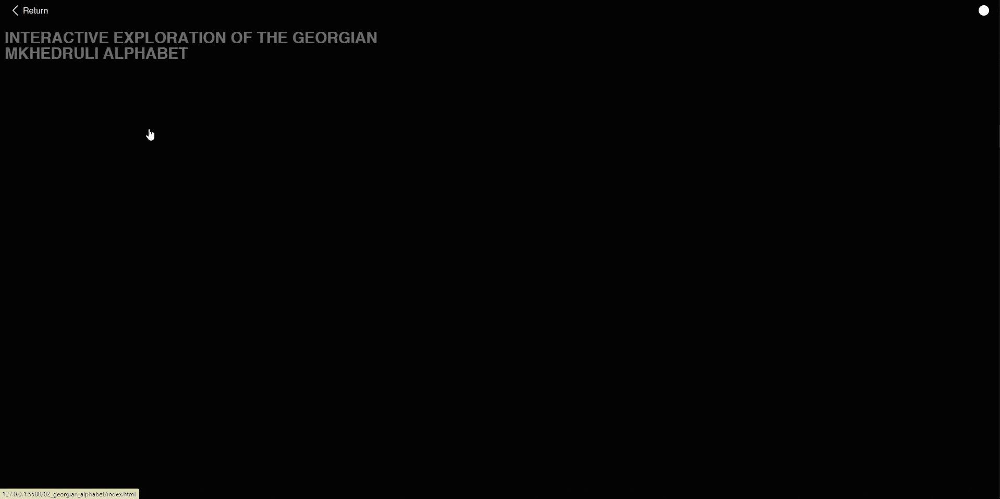

# Georgian Language Self-Study Guide

This project is an interactive self-study guide for learning the Georgian language. It features a unique approach to learning the alphabet and words, making it an engaging experience for users.

## Features

- **Interactive Georgian Alphabet**: A dynamic way to learn each letter of the Georgian alphabet and associated words.
- **Dynamic Content**: The content dynamically adjusts, enhancing the learning experience.

## Project Structure

The project is structured as follows:

- `02_georgian_alphabet`: Contains HTML and JavaScript for the interactive alphabet feature.
  - `Alphabet.js`: Manages the creation and logic of the alphabet.
  - `Letter.js`: Responsible for rendering individual letters and their associated words.
- `0_intro`: Includes the introductory page with associated styles and scripts.
- `css`: Common styles for the project.
- `svg`: Images used in the project.

## Getting Started

To get started with the project, clone the repository and open `intro.html` in your web browser.

---

## Самоучитель Грузинского Языка

Этот проект — интерактивное пособие для самостоятельного изучения грузинского языка. Основные особенности — интерактивный алфавит и динамическое содержание. Для начала работы склонируйте репозиторий и откройте `intro.html` в браузере.